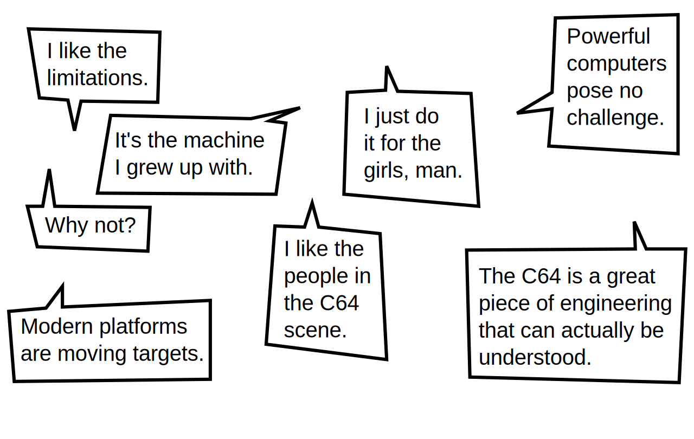
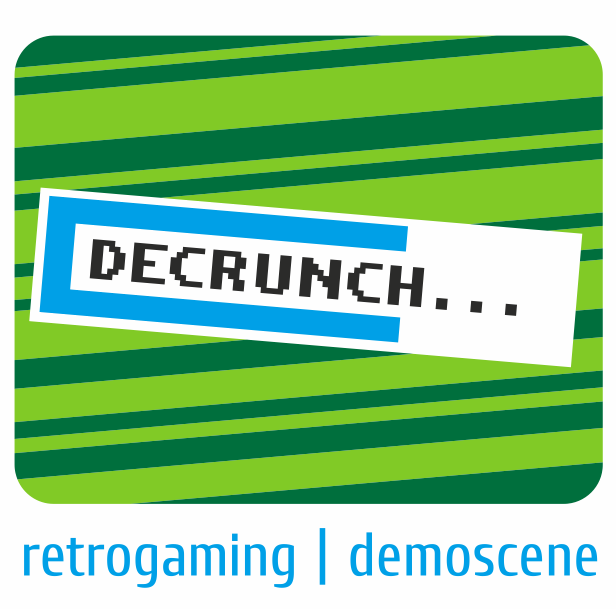

Demoscene
=========

## for uninitiated

 

  Kuba Winnicki / CTO @ PIXERS

  <small>_vel_</small>
   
  vino / dreamweb ^ anadune

 

<code>PRESS SPACE TO BEGIN</code>

---

<iframe title="YouTube video player" class="youtube-player" type="text/html"
        width="640" height="390" src="http://www.youtube.com/embed/PSwgZ7wGus0"
        frameborder="0" allowFullScreen></iframe>

---

What is demoscene?
-----------------

<ul>
  <li class="fragment">demo
    <ul>
      <li class="fragment">audio-visual media</li>
      <li class="fragment">generated in real-time</li>
    </ul>
  <li class="fragment">scene
    <ul>
      <li class="fragment">place</li>
      <li class="fragment">society</li>
      <li class="fragment">subculture</li>
    </ul>
  </li>
</ul>

---

the beginning
-------------

<ul>
  <li>first demo</li>
  <li class="fragment">crack intros</li>
  <li class="fragment">parties</li>
</ul>

Note: How that was with /me

----

productions
-----------

<ul>
 <li>demo</li>
 <li class="fragment">intro: 64k, 4k etc.</li>
 <li class="fragment">zak</li>
 <li class="fragment">pixel graphics</li>
 <li class="fragment">raytrace</li>
 <li class="fragment">ASCII, ANSI, PETSCII ...</li>
</ul>

---

motivations
-----------

---

limits
------

_push the wall_

<ul>
 <li class="fragment">size limits: 64k, 4k ...</li>
 <li class="fragment">platforms: pc, c64, amiga, web ...</li>
</ul>

----

platforms
---------

---

respect
-------

is the core value

no money can buy you respect

---

vocabulary
----------

 - demo
 - party
 - platforms (old & newschool)
 - compo - kompot
 - prods, gfx, msx, code
 - lamers
 - fuckings!

---

famous people and companies
---------------------------

### coming from demoscene

 - Adam Skorupa
   <b>(scorpik)</b>
   <i class="fragment">- Witcher OST</i>
 - Jesper Kyd
   <b>(jesper kyd/silents)</b>
   <i class="fragment">- Assassin's Creed OST</i>
 - Andrzej Dragan
   <b>(dreamer/flying cows)</b>
   <a href="http://andrzejdragan.com/">
     <i class="fragment">Photography</i>
   </a>
 - IO Interactive
   <b>(cryonics)</b>
   <i class="fragment">Hitmen, Assassin's Creed</i>
 - DICE
   <b>(the silents)</b>
   <i class="fragment">Battlefield series</i>
 - and many, many more…

---

sources and references
---------------------

 * [pouët.net](http://www.pouet.net/), [demozoo.org](http://demozoo.org/), [csdb](http://csdb.dk/), [ada](http://ada.untergrund.net/)
 * [scenery](http://artscene.textfiles.com/history/scenery/scenery/yearall.txt)
 * [famous people from demoscene](https://chipflip.wordpress.com/2015/06/12/famous-people-who-came-from-the-demoscene/)
 * [state of the demoscene](http://blog.subsquare.com/state-of-the-demoscene-1991-2014/) by [gloom303](https://twitter.com/gloom303)
 * [poems for bugs](https://youtu.be/zshl62g0H8w) by [lft/cryo](http://www.linusakesson.net/)
 * [moleman 2](https://youtu.be/iRkZcTg1JWU)
 * [europe in 8-bits](https://vimeo.com/90556803)

---

#### farbrausch @ breakpoint 2007
#### fr-041: d e b r i s .

pc demo ~ size of c64 floppy disk side

----

<iframe title="YouTube video player" class="youtube-player" type="text/html"
        width="768" height="576" src="http://www.youtube.com/embed/4BMH9K1UDK8"
        frameborder="0" allowFullScreen></iframe>

---

### thank you

Follow us on:

  
  
  
  
  

